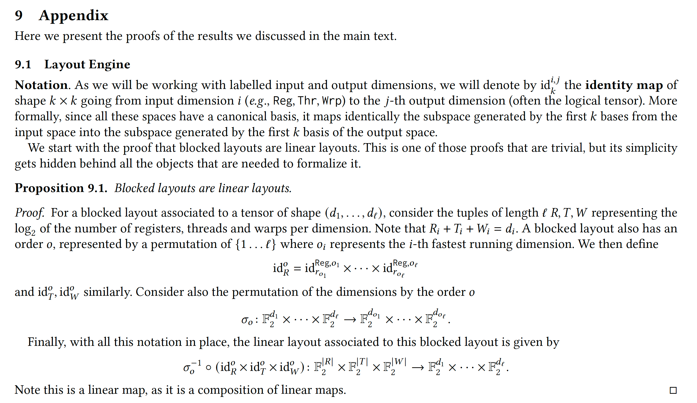

# Identity Maps

### 1. Are identity maps matrices?
**Yes, exactly.** Because this paper models everything as linear transformations over the finite field $\mathbb{F}_2$ (where the only numbers are 0 and 1, and addition is XOR), every single map discussed in that proof can be written as a matrix.

Specifically, these identity maps are just matrices made of 1s and 0s. 
* If a map transfers 3 bits straight across (like our thread-to-column map $\text{id}_{T_1}^{\text{Thr}, 1}$), its matrix representation is simply a $3 \times 3$ identity matrix:
$$
\begin{bmatrix}
1 & 0 & 0 \\
0 & 1 & 0 \\
0 & 0 & 1
\end{bmatrix}
$$
* If a map transfers 1 bit (like $\text{id}_{R_1}^{\text{Reg}, 1}$), it is just a $1 \times 1$ matrix: $[1]$.

When the paper says "map," you can always mentally substitute the word "matrix."

---

### 2. Does the symbol $\times$ mean the direct sum operation?
**Functionally, yes! You hit the nail on the head.**

Formally, in abstract algebra, the $\times$ symbol here denotes the **Cartesian product** of functions acting on a Cartesian product of vector spaces (e.g., $\mathbb{F}_2^{R_1} \times \mathbb{F}_2^{R_2}$). 

However, when you translate that Cartesian product of functions into *matrices*, it becomes exactly the **matrix direct sum (often denoted as $\oplus$)**. 

When you take the direct sum of matrices, you are taking those smaller matrices and stacking them along the diagonal to build a larger block matrix, filling the rest of the space with zeros.

The entire $8 \times 8$ matrix $A$ from your very first screenshot is built by taking the direct sum of the Register matrix, the Thread matrix, and the Warp matrix, placing them along the diagonal!

## Registers
Let's look at your formula: $\text{id}_R^o = \text{id}_{R_1}^{\text{Reg}, 1} \times \text{id}_{R_2}^{\text{Reg}, 2}$

From our earlier Layout A example:
* $\text{id}_{R_1}^{\text{Reg}, 1}$ takes 1 register bit and routes it to the column dimension (logical index $j$). It is a $1 \times 1$ matrix: $[1]$.
* $\text{id}_{R_2}^{\text{Reg}, 2}$ takes 1 register bit and routes it to the row dimension (logical index $i$). It is also a $1 \times 1$ matrix: $[1]$.

When you combine them with the $\times$ operator, you construct a $2 \times 2$ block diagonal matrix (the direct sum):
$$
\text{id}_R^o = 
\begin{bmatrix}
[1] & 0 \\
0 & [1] 
\end{bmatrix}
=
\begin{bmatrix}
1 & 0 \\
0 & 1 
\end{bmatrix}
$$

This perfectly describes the logic: "The first input bit affects only the first output slot, and the second input bit affects only the second output slot. They do not mix." 

## Threads
Let's build the Thread matrix block ($\text{id}_T^o$) step-by-step using the direct sum operation we just talked about.

From the paper's proof, the Thread map is defined as:
$$\text{id}_T^o = \text{id}_{T_1}^{\text{Thr}, 1} \times \text{id}_{T_2}^{\text{Thr}, 2}$$

### 1. The Building Blocks
From our Layout A ($16 \times 16$) example, we know the 5 Thread bits are split into 3 bits for the columns ($T_1$) and 2 bits for the rows ($T_2$).

* **The Column Map ($\text{id}_{T_1}^{\text{Thr}, 1}$):** Since $T_1 = 3$, this is simply a $3 \times 3$ identity matrix. It takes 3 thread bits and outputs 3 column bits.
$$
\text{id}_{T_1} = 
\begin{bmatrix}
1 & 0 & 0 \\
0 & 1 & 0 \\
0 & 0 & 1
\end{bmatrix}
$$

* **The Row Map ($\text{id}_{T_2}^{\text{Thr}, 2}$):** Since $T_2 = 2$, this is a $2 \times 2$ identity matrix. It takes the remaining 2 thread bits and outputs 2 row bits.
$$
\text{id}_{T_2} = 
\begin{bmatrix}
1 & 0 \\
0 & 1
\end{bmatrix}
$$

### 2. The Direct Sum ($\times$ / $\oplus$)
When we apply the Cartesian product ($\times$) to these linear maps, we are taking their matrix direct sum ($\oplus$). This means we place our $3 \times 3$ matrix and our $2 \times 2$ matrix along the diagonal of a new, larger matrix, and fill the empty spaces with zeros.

$$
\text{id}_T^o = \text{id}_{T_1} \oplus \text{id}_{T_2} = 
\begin{bmatrix}
\begin{bmatrix} 1 & 0 & 0 \\ 0 & 1 & 0 \\ 0 & 0 & 1 \end{bmatrix} & \begin{matrix} 0 & 0 \\ 0 & 0 \\ 0 & 0 \end{matrix} \\
\begin{matrix} 0 & 0 & 0 \\ 0 & 0 & 0 \end{matrix} & \begin{bmatrix} 1 & 0 \\ 0 & 1 \end{bmatrix}
\end{bmatrix}
$$

When you erase the inner brackets, you are left with a perfect $5 \times 5$ block diagonal matrix:

$$
\text{id}_T^o = 
\begin{bmatrix}
1 & 0 & 0 & 0 & 0 \\
0 & 1 & 0 & 0 & 0 \\
0 & 0 & 1 & 0 & 0 \\
0 & 0 & 0 & 1 & 0 \\
0 & 0 & 0 & 0 & 1
\end{bmatrix}
$$

## Proposition 9.1

  

$\text{id}_R^o = \text{id}_{r_{o_1}}^{\text{Reg},o_1} \times ... \times \text{id}_{r_{o_l}}^{\text{Reg},o_l}$

Based on the provided image, the map $\text{id}_R^o$ is part of the process of formalizing how a "blocked layout" assigns bits from a specific hardware resource (in this case, Registers) to the logical dimensions of a tensor.

To make this concrete, let's create a step-by-step example for a 2-dimensional tensor (e.g., a matrix).

### 1. The Setup (Choosing Concrete Values)

Let's define the parameters for our example:

* **Dimensions ($\ell$):** Let $\ell = 2$ (a 2D tensor with dimensions 1 and 2, e.g., rows and columns).
* **Tensor Shape in $log_2(d)$:** Let the tensor shape be $(d_1, d_2) = (4, 4)$. This means the actual tensor has $2^4 = 16$ rows and $2^4 = 16$ columns.
* **Register Tuple ($R$):** The text states $R$ is a tuple representing the $log_2$ of the number of registers per dimension. Let $R = (r_1, r_2) = (1, 1)$.
  * *Meaning:* We are assigning $2^1=2$ registers to dimension 1, and $2^1=2$ registers to dimension 2. The total number of register bits is $|R| = r_1 + r_2 = 2$.

* **Order ($o$):** The order $o$ is a permutation of the dimensions $\{1, 2\}$, representing the fastest to slowest running dimensions. Let $o = (2, 1)$.
  * *Meaning:* $o_1 = 2$ (dimension 2 is the fastest running), and $o_2 = 1$ (dimension 1 is the slowest).

### 2. Plugging into the Formula

The proposition defines the map as a Cartesian product of identity maps for each dimension, ordered by $o$:

$$\text{id}_R^o = \text{id}_{r_{o_1}}^{\text{Reg}, o_1} \times \text{id}_{r_{o_2}}^{\text{Reg}, o_2}$$

Substitute our concrete values ($o_1 = 2$, $o_2 = 1$):

$$\text{id}_R^o = \text{id}_{r_2}^{\text{Reg}, 2} \times \text{id}_{r_1}^{\text{Reg}, 1}$$

Substitute the register bit counts ($r_2 = 1$, $r_1 = 1$):

$$\text{id}_R^o = \text{id}_1^{\text{Reg}, 2} \times \text{id}_1^{\text{Reg}, 1}$$

### 3. What does this map actually do?

According to the "Notation" paragraph, $\text{id}_k^{i,j}$ maps the first $k$ bases of the input space $i$ to the first $k$ bases of the output space $j$. (Here, "the first $k$ bases" = the first $k$ bits)

Our input space is the Register space $\mathbb{F}_2^{|R|}$, which has 2 bits. Let's call these 2 bits $(b_0, b_1)$.
Because it is a Cartesian product, the map processes these input bits in order:

1. **First part ($\text{id}_1^{\text{Reg}, 2}$):** It takes the first $r_2 = 1$ bit from the register space (which is $b_0$) and maps it identically to the first bit of the subspace for **output dimension 2**.
2. **Second part ($\text{id}_1^{\text{Reg}, 1}$):** It takes the next $r_1 = 1$ bits from the register space (which are $b_1$) and maps them identically to the first bit of the subspace for **output dimension 1**.

### Summary of the Concrete Example

In this scenario, $\text{id}_R^o$ is a linear map that takes a 2-bit register index $(b_0, b_1)$ and routes the bits into a partitioned logical space based on the layout order:

* The **0th bit** ($b_0$) is routed to control the logical coordinate of **dimension 2** (because dim2 is the fastest running dimension, it gets the lowest/first register bits).
* The **1st bit** ($b_1$) are routed to control the logical coordinate of **dimension 1**.

*(Note: In the full formula at the bottom of the image, the $\sigma_o^{-1}$ permutation is then applied to cleanly reorder these partitioned spaces back to standard $(dim_1, dim_2)$ tensor order).*

## What does "the first $k$ bases" really mean?
In the context of this paper, which bridges linear algebra and hardware execution, the phrase **"the first $k$ bases"** is a formal, mathematical way of saying **"the lowest $k$ bits."**

To understand why, we have to look at how the paper models hardware resources (like Registers, Threads, or Warps) and tensor dimensions: it treats them as **vector spaces over the binary field $\mathbb{F}_2$**.

Here is the breakdown of what that means in practice:

### 1. What is a "Basis"? (The Linear Algebra View)

In linear algebra, a vector space is defined by its "basis" vectors. Since the paper is working with bits ($\mathbb{F}_2$), an $n$-bit number is treated as an $n$-dimensional vector.

The **"canonical basis"** (standard basis) for a space of bits consists of vectors where exactly one position is a `1` and the rest are `0`. Each basis vector corresponds to a specific bit position:

* $e_0 = (1, 0, \dots)$ represents **Bit 0**
* $e_1 = (0, 1, \dots)$ represents **Bit 1**

Any index (like Register ID `6`, which is binary `110`) is just a linear combination of these basis vectors: `0`$\cdot e_0 + $`1`$\cdot e_1$.

### 2. What does "the first $k$ bases" mean?

It simply means the set of basis vectors $\{e_0, e_1, \dots, e_{k-1}\}$. In computer science terms, this refers to the **$k$ least significant bits (LSBs)** of a value.

When the text says "the subspace generated by the first $k$ bases", it means all possible binary numbers you can make using *only* those first $k$ bits.

### 3. Putting it together: The Identity Map

The text describes the map $\text{id}_k^{i,j}$ as doing the following:

> "...it maps identically the subspace generated by the first $k$ bases from the input space into the subspace generated by the first $k$ basis of the output space."

**Translation:**
It takes the **lowest $k$ bits** from the input variable $i$ (e.g., your Register ID) and copies them exactly to become the **lowest $k$ bits** of the output variable $j$ (e.g., a logical tensor coordinate).

### Concrete Example

Let's return to the map from our previous example: $\text{id}_1^{\text{Reg}, 1}$

* **Input ($i$):** Register space. Let's say we have 2 total register bits available $(b_0, b_1)$.
* **Output ($j$):** Logical dimension 1.
* **$k = 1$:** "The first basis".

This map grabs the first bit (basis $e_0$) of the available input register bits—let's say they are $b_1$ based on where we are in the Cartesian product—and maps them *identically* to the first bit position (basis $e_0$) of logical dimension 1.

**Why use this complex language?**
By expressing simple bit-routing (e.g., "take these two register bits and use them to calculate the row index") as "linear maps between subspaces," the authors can represent the entire layout as a giant matrix over $\mathbb{F}_2$. This allows them to mathematically prove things about layouts (like invertibility, or whether two layouts are equivalent) using standard linear algebra, which is what they are doing in Proposition 9.1.

## Matrix A and The Mathematical Bridge (The Interleaver Matrix)
If we strictly follow the formal definitions of linear algebra, building those individual matrices $\text{id}_R^o$, $\text{id}_T^o$, and $\text{id}_W^o$ yields $I_2$, $I_5$, and $I_1$. Taking their direct sum (which is what the Cartesian product of linear maps translates to in matrix form) yields exactly the block-diagonal matrix **$I_8$**.

You have uncovered a classic mathematical shortcut—often called an **implicit canonical isomorphism**—that the authors used in their notation.

Here is exactly what is happening between your rigorous (and correct) math and the paper's equation.

### 1. The Result of Your Strict $I_8$ Matrix

If we apply the strict $I_8$ matrix to our input vector, the output vector groups the bits exactly as they were created: first all Registers, then all Threads, then all Warps.

Using our $o = (2, 1)$ example, the output of $I_8$ lives in this vector space:

$$(\mathbb{F}_2^{R_2} \times \mathbb{F}_2^{R_1}) \times (\mathbb{F}_2^{T_2} \times \mathbb{F}_2^{T_1}) \times (\mathbb{F}_2^{W_2} \times \mathbb{F}_2^{W_1})$$

The resulting vector looks like this:

$$[r_0, r_1, t_0, t_1, t_2, t_3, t_4, w_0]^T$$

### 2. The Collision with $\sigma_o^{-1}$

This is where the paper's shortcut becomes visible. Look at the domain (the expected input space) for the final permutation function $\sigma_o^{-1}$ in the proposition:

$$\sigma_o^{-1} : \mathbb{F}_2^{d_{o_1}} \times \dots \times \mathbb{F}_2^{d_{o_\ell}}$$

Because $d_i = R_i + T_i + W_i$, the function $\sigma_o^{-1}$ expects an input vector that is grouped strictly by dimensions, not by resources. It expects the space:

$$(\mathbb{F}_2^{R_2} \times \mathbb{F}_2^{T_2} \times \mathbb{F}_2^{W_2}) \times (\mathbb{F}_2^{R_1} \times \mathbb{F}_2^{T_1} \times \mathbb{F}_2^{W_1})$$

### 3. The Implicit Step

Your $I_8$ matrix outputs the form $(R_2, R_1, T_2, T_1, W_2, W_1)$.
The next function expects the form $(R_2, T_2, W_2, R_1, T_1, W_1)$.

In rigorous category theory and higher-level linear algebra, when a map produces $(X \times Y) \times (Z \times W)$ but the next step expects $(X \times Z) \times (Y \times W)$, mathematicians will often treat these two spaces as "equal" because there is a completely natural, obvious way to rearrange them. They omit the permutation matrix that interleaves them from the notation to save space.

Let's call this implicit bridge matrix $P$.

The strict pipeline actually looks like this:

$$y = \sigma_o^{-1}(P(I_8 \cdot x))$$

Where:

* $x$ is the raw hardware bits.
* $I_8$ is the true strict product of the identity maps.
* **$P$ is the implicit canonical isomorphism** (the interleaving matrix we built earlier).
* $\sigma_o^{-1}$ is the final block-swapper.

Because $P \cdot I_8 = P$, and because mathematicians view $P$ as "trivially obvious rearranging," they collapse the notation. They write $\text{id}_R^o \times \text{id}_T^o \times \text{id}_W^o$ but execute the matrix $P$.

As a software engineer, whenever you see mathematicians casually state "up to isomorphism" or treat cross products as associative/commutative, read that as: **"Insert memory scatter/gather operations or array transpositions here."** The math guarantees it's a lossless conversion, but the code still has to do the routing work.

