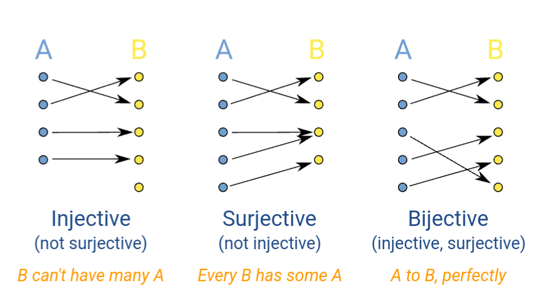

# Injection, Surjection, and Bijection
- Injection: One-to-one mapping
- Surjection: Domain-onto-codomain mapping (range is identical to codomain)
- Bijection: One-to-one and domain-onto-codomain mapping

