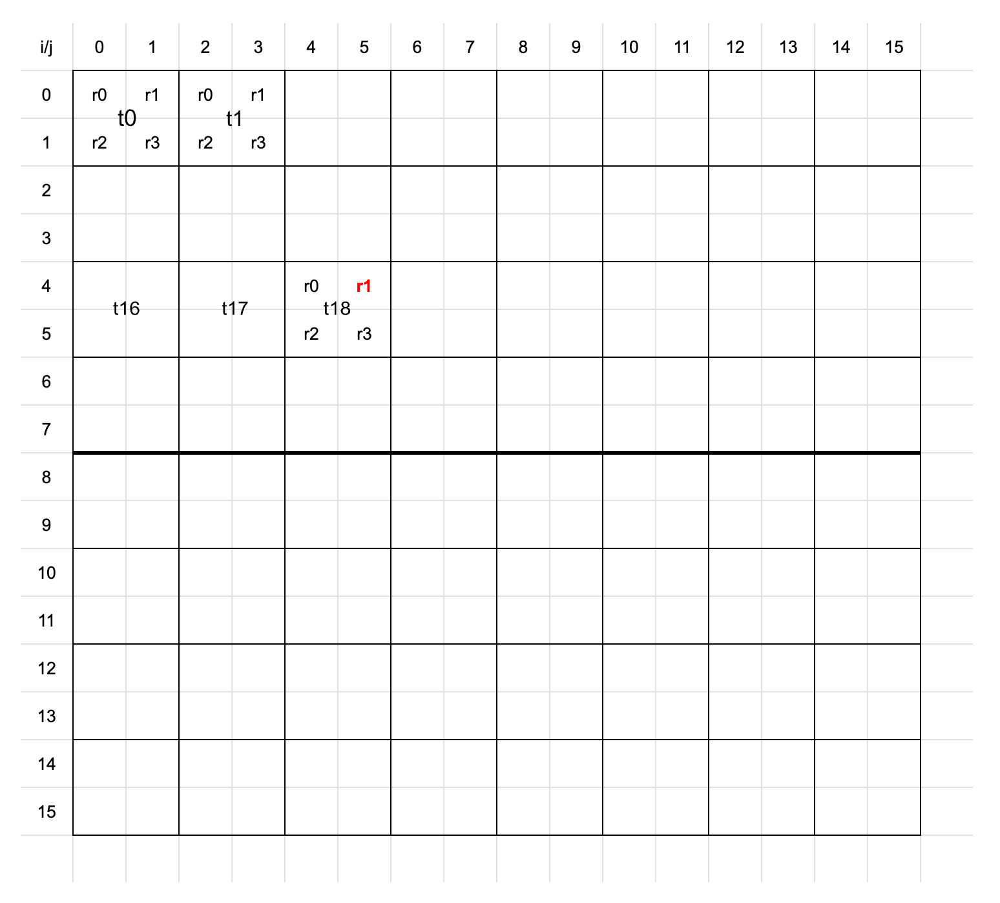

# layoutA

## Linear Register Indices
$i_R = 0, 1$ (1 bit)  
$j_R = 0, 1$ (1 bit)  
$l_R = 0, 1, 2, 3$ (2 bits)  

We will prove that $l_R = i_R | j_R$ as follows: 
$l_R = i_R \cdot (\text{Number of Register Columns}) + j_R$  
$l_R = i_R \cdot 2 + j_R$  
$l_R = i_R \cdot 2^1 + j_R$  
$l_R = i_R \ll 1 + j_R$  

In binary representation, $i_R$ occupies 1 bit, $j_R$ occupies 1 bit.  
So $i_R \ll 1$ leaves exactly 1 empty zero in the least significant bit (LSB) slot.  
Because $j_R$ perfectly fits into the 1 empty zero slot created by shifting $i_R$, **adding them together will never cause a binary carry.** The bits are strictly non-overlapping.

Therefore, the arithmetic addition is strictly equivalent to the bitwise OR/concatenation operator (which we represent as `|`):  
$l_R = i_R \ll 1 + j_R$  
$l_R = i_R|j_R$

## Linear Thread Indices
Denote that 
- $i_T$ be the local row index of a thread, $i_T \in [0, 3]$ (represented by 2 bits).
- $j_T$ be the local column index of a thread, $j_T \in [0, 7]$ (represented by 3 bits).
- $l_T$ be the 1D linear index of a thread, $l_T \in [0, 31]$ (represented by 5 bits).
- `|` is the bit concatenation operator.

We will prove that $l_T = i_T | j_T$.

### 1. Linear Index Axiom
In any standard 2D array or grid, to find the 1D linear index of an element, you use the standard row-major indexing formula: 
$l_T = i_T \cdot (\text{Number of Thread Columns}) + j_T$

### 2. Substitute the Known Values
We are given the bounds of the grid:
* Number of Thread columns $= 8$ (since $j_T \in [0, 7]$).
* Number of Thread rows $= 4$ (since $i_T \in [0, 3]$).

Substitute the number of Thread columns into the equation:
$$l_T = i_T \cdot 8 + j_T$$

### 3. Convert to Base-2 (Powers of Two)
Because GPU warp sizes are strictly powers of two, we can rewrite the number of Thread columns ($8$) as $2^3$:
$$l_T = i_T \cdot 2^3 + j_T$$

### 4. The Binary Shift and Concatenation
In binary arithmetic, multiplying a number by $2^n$ is the exact equivalent of applying a **bitwise left shift** by $n$ positions.
* $i_T \cdot 2^3$ shifts the bits of $i_T$ to the left by 3 positions. 
* This leaves exactly 3 empty zeros in the least significant bit (LSB) slots. For example, if $i_T = 3$ (binary `11`), then $i_T \cdot 2^3 = 24$ (binary `11000`).

Now, look at $j_T$. Because $j_T \in [0, 7]$, it requires exactly 3 bits to represent (from `000` to `111`).

Because $j_T$ perfectly fits into the 3 empty zero slots created by shifting $i_T$, **adding them together will never cause a binary carry.** The bits are strictly non-overlapping.

Therefore, the arithmetic addition is strictly equivalent to the bitwise OR/concatenation operator (which we represent as `|`):  
$l_T = (i_T \ll 3) + j_T$  
$l_T = i_T \mid j_T$

## Linear Warp Indices
$l_W = i_W$ since Number of Warp Columns is $2^0$ and $j_W = 0$.

## The relationship between local coordinates and global coordinates
Imagine the total width of the tensor as a single long ruler. To find the exact global column index $j$ of a specific element, we start at the far left edge (coordinate $0$) and measure the distance to our target element by adding up the widths of the blocks that come *before* it.

**Step 1: The Warp Jump** 
Our target element is located inside warp column $j_W$. This means there are exactly $j_W$ full warps sitting to the left of our target warp. 
* How wide is one full warp in columns? It contains $W_T$ threads horizontally, and each thread holds $W_R$ columns. So, one warp spans $(W_T \cdot W_R)$ columns.
* **Distance traversed:** $j_W \cdot (W_T \cdot W_R)$

**Step 2: The Thread Jump** 
Now we are standing at the left edge of our target warp. Inside this warp, our element is in thread column $j_T$. This means there are $j_T$ full threads to the left of our target thread.
* How wide is one full thread? It spans $W_R$ columns.
* **Distance traversed:** $j_T \cdot W_R$

**Step 3: The Register Jump** 
Now we are standing at the left edge of our target thread. Inside this thread's block, our element is at column offset $j_R$.
* **Distance traversed:** $j_R$

**Conclusion:** 
Because these blocks are perfectly nested and do not overlap, the total global coordinate $j$ is strictly the sum of these segments:  
$j = j_W \cdot (W_T \cdot W_R) + j_T \cdot W_R + j_R$

## Physical Bit Vector
Denote $p = l_W | l_T | l_R$ be the physical index of a tensor element.  
$p = i_W | i_T | j_T | i_R | j_R$  
$p = v_7|v_6|v_5|v_4|v_3|v_2|v_1|v_0$  
where
- $j_R = v_0$
- $i_R = v_1$
- $j_T = |v_4|v_3|v_2$
- $i_T = v_6|v_5$
- $i_W = v_7$

We define $v = (v_0, v_1, v_2, v_3, v_4, v_5, v_6, v_7)$ be the physical bit vector of a tensor element. Then, 

$A v$ = $v_0C_0 + v_1C_1 + v_2C_2 + v_3C_3 + v_4C_4 + v_5C_5 + v_6C_6 + v_7C_7$  
$A v$ = $v_0C_0 \oplus v_1C_1 \oplus v_2C_2 \oplus v_3C_3 \oplus v_4C_4 \oplus v_5C_5 \oplus v_6C_6 \oplus v_7C_7$  

Say, the values of $v_0$, $v_3$, $v_5$ are $1$, the rest of bits are all $0$. i.e.  
$v = (1, 0, 0, 1, 0, 1, 0, 0)$  

Then,  
$A v$ = $v_0C_0 \oplus v_3C_3 \oplus v_5C_5$  
$A v$ = $C_0 \oplus C_3 \oplus C_5$  
